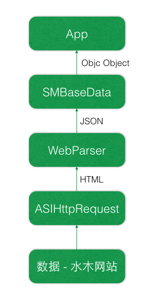

#关于

xsmth是一个开源的第三方水木客户端。欢迎大家提交新的功能，和提供修改意见。

#Lisence
Common, Utils, Data, jsParser目录下的代码准训MIT证书，可以使用这些代码开发自己的App，并且不需要作者授权。
其他目录（水木功能相关），需要作者授权使用。

#开始

首先需要安装facebook的xtool脚本（ReactiveCocoa会用到）。
下载源码后，运行 

	$ ./startup.sh
	
#数据流

#技术点

xsmth中最重要的模块是WebParser这块。WebParser提供了一套js（参考jsParser下的文件）方法来解析抓取到的html，使用js、dom操作，方便的将html转为app需要的json数据。  
WebParser非常适合在web站点功能完备的情况下使用，无需后台开发就可以提供一套json数据。  
WebParser用到的js引擎可以动态下载，在web界面变更的情况下，可动态更新解析引擎即可。  